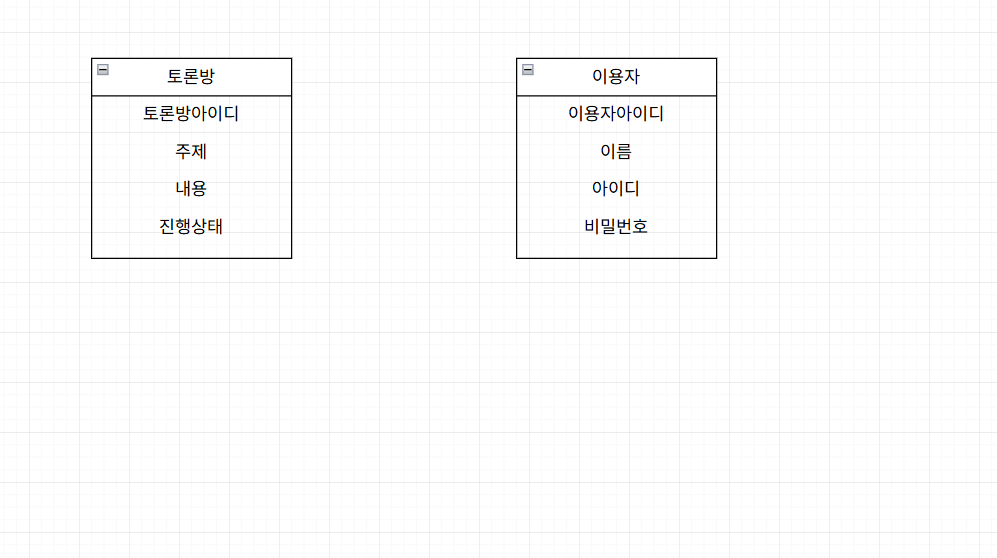
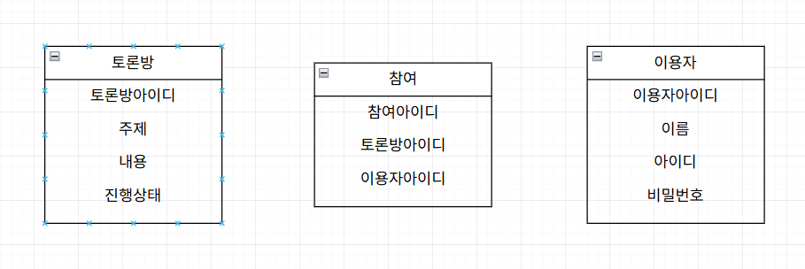

# 실시간 토론 서비스 개발 

## 단계 : 사용자 요구사항 -> 데이터 모델링 -> 시스템 아키텍쳐 설계 -> 비즈니스 로직 설계 -> 테스트 설계 -> 배포 

## 1. 사용자 요구사항 

### § 토론방 관련 

1. 토큰 목록 조회 : 현재 진행중인 토론 주제들을 리스트로 볼 수 있어야 한다. 

2. 토론방 생성 : 새로운 주제를 던지고 토론방을 개설할 수 있어야 한다. 

3. 상태 관리 : 토론이 진행되었는지 종료되었는지 표시되어야한다. 

### § 실시간 소통 

진영 선택: 방에 입장할 때 '찬성', '반대', 혹은 '구경하기(관전자)' 중 하나를 선택해야 한다.

실시간 메시징: 내가 보낸 메시지가 같은 방의 모든 사람에게 실시간으로 전달되어야 한다.

진영 표시: 채팅창에서 내가 어느 진영인지(예: 이름 옆에 빨간색/파란색 라벨) 명확히 보여야 한다.

메시지 저장: 새로 고침을 해도 이전 대화 내용이 유지되어야 한다.

### § 실시간 인터랙션 (Interaction) - 변별력 포인트

실시간 투표(좋아요): 관전자는 실시간으로 올라오는 채팅 메시지에 대해 '좋아요'를 눌러 힘을 실어줄 수 있다.

우세 그래프 업데이트: 좋아요 점수를 합산하여 화면 상단의 '찬성 vs 반대' 게이지 바가 실시간으로 움직여야 한다.

동시성 처리: 수백 명이 동시에 좋아요를 눌러도 시스템에 과부하가 걸리지 않고 정확히 집계되어야 한다.

## 2. 데이터 모델링

### § 사용자 요구사항에서 키워드 추출하기 

* 토론방, 주제, 진행, 종료 
* 진영 - (찬성, 반대, 관전자), 메시지, 사람, 채팅창, 빨간색, 파란색 라벨
* 투표 - (좋아요, 싫어요), 그래프, 점수, 게이지 바

  

### § 실체 엔터티 설계하기 

#### 실체 엔터티란? -> 무언가에 의존하지 않고 스스로 존재할 수 있는 데이터 

#### 위의 요구사항에서 뽑은 실체 엔터티 : 토론방, 사람(이용자) 

#### 메세지는 이용자가 발생시키기 때문에 의존성이 있음 => 실체 엔터티 X 

### § 다대다 테이블 생성하기 

#### 사용자 요구사항 분석 => 한명의 이용자는 여러 토론방에 참여할 수 있다 && 하나의 토론방에 여러 이용자가 참여할 수 있다. 

#### 따라서 토론방과 이용자 사이에 참여라는 테이블을 생성함 

#### 여기서 참여 테이블은 사용자가 어느 토론방에 참여했는지를 기록할 수 있게 해준다. 

