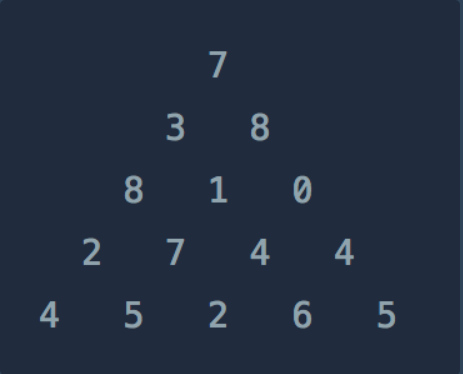

## dp란
<br/>

### ◆ 개념 : 문제를 작은 문제로 분할하여 해결하는 방법. 

####  중복되는 문제를 반복문으로 중복 계산 => 비효율적 , 시간 초과 


####  메모이제이션을 통해 이전에 계산한 문제를 다시 계산 X        => 점화식에서 이미 계산한 적이 있다면 바로 값을 리턴해줌 

<br/><br/>

### ◆ dp의 사용조건 

#### 1. 겹치는 소문제 : 문제를 작은 문제로 나눴을 때 작은 문제의 결과를 재사용해서 원하는 결과를 도출할 수 있을때 

#### 2. 최적 부분 구조 : 작은 문제에서 구한 최적의 결과가 전체 문제의 최적 결과와 같을 때 

ex) A-C 의 최단경로 = A-B , B-C 최단경로의 합

<br/><br/>

### ◆ dp 관련 해결 문제 : 정수 삼각형 



<br/>

#### 요약 : 꼭대기에서 바닥까지 이어지는 경로 중, 거쳐간 숫자의 합이 가장 큰 경우를 리턴 

#### 점화식 : dp[i][j] = dp[i-1][j], dp[i-1][j-1] 의 최댓값 + 현재값. 

#### 코드 

```java
import java.lang.*; 

class Solution {
    public int solution(int[][] triangle) {
        int answer = 0;
        
        int r = triangle.length; 
        int c = triangle[r-1].length; // 마지막 행의 열 개수  
        
        int[][] dp = new int[r][c]; 
        
        if(r == 1) return dp[0][0]; 
        
        dp[0][0] = triangle[0][0]; 
        
        for(int i=1;i<r;i++) {
            for(int j=0;j<triangle[i].length;j++) {
                if(j > 0) {
                    dp[i][j] = dp[i-1][j-1] + triangle[i][j]; 
                }
                if(j < triangle[i].length-1) {
                    dp[i][j] = Math.max(dp[i][j] , dp[i-1][j] + triangle[i][j]); 
                }
            }
        }
        
        for(int i=0;i<c;i++) {
            answer = Math.max(answer , dp[r-1][i]); 
        }
        return answer;
    }
}

```
<br/><br/>

### ◆ 이 코드에서 보완할 점

#### 1. dp 배열을 굳이 사용할 필요 없음. 이유 : triangle 배열 안의 값을 계산한 이후 저장하고 있을 필요가 없기 때문에 

#### 2. 마지막 행에서 최댓값 도출할때 for문이 아님 Arrays 클래스의 정적 메소드 stream()을 사용하여 최댓값 도출하기 


<br/>

### ◆ 스트림(stream)이란 

#### 컬렉션(List, Set 등)이나 배열에 저장된 요소들을 하나씩 꺼내어 원하는대로 가공하고 결과를 도출하는 함수형 프로그래밍 도구 

### 가공 방법 

### § 중간 연산 

#### 1. filter : 원하는 요소만 걸러서 공급 
#### 2. map    : 요소를 다른 값으로 변환(ex : 소문자를 대문자로)
#### 3. sorted : 요소를 정렬함


### § 최종 연산 
#### 1. collect(): 결과를 다시 List나 Map으로 변환

#### 2. forEach(): 각 요소를 출력하거나 소모

#### 3. count(), sum(), average(): 통계값 산출


### ◆ 수정 코드 

```java
import java.lang.*; 
import java.util.*; 


class Solution {
    public int solution(int[][] triangle) {
        int answer = 0;
        
        int r = triangle.length; 
        int c = triangle[r-1].length; // 마지막 행의 열 개수  
        
        for(int i=1;i<r;i++) {
            triangle[i][0] += triangle[i-1][0]; 
            triangle[i][triangle[i].length-1] += triangle[i-1][triangle[i].length-2]; 
            
            for(int j=1;j<triangle[i].length-1;j++) {
                triangle[i][j] += Math.max(triangle[i-1][j-1], triangle[i-1][j]); 
            }
        }
        
        return Arrays.stream(triangle[r-1]).max().getAsInt();
        
    }
}

```

### 수정된 점 

#### 1. dp 배열 제거 : triangle의 기존의 값을 저장할 필요가 없으므로 추가 배열이 필요없음. 

#### 2. 첫번째 또는 마지막 열 -> 더할 값이 한가지 
####    나머지 열  -> i-1,j-1  i-1,j 의 값 중 큰값을 더함 

#### 3. Arrays.stream()을 이용하여 최대값을 구하고 max()메소드는 리턴값이 OptionalInt이므로 OptionalInt의 getAsInt 메소드를 이용하여 최댓값을 리턴함